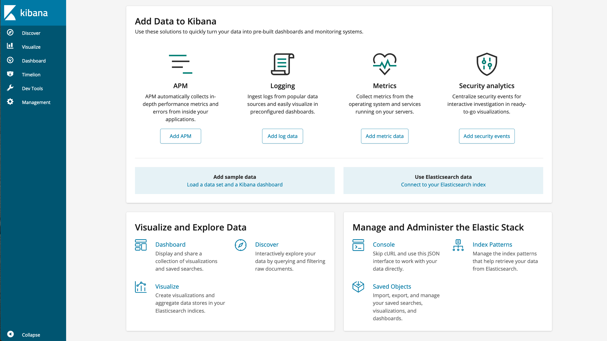

---
copyright:
  years: 2020, 2021
lastupdated: "2021-02-02"

keywords: kibana

subcollection: databases-for-elasticsearch

---

{:shortdesc: .shortdesc}
{:new_window: target="_blank"}
{:codeblock: .codeblock}
{:pre: .pre}
{:screen: .screen}
{:tip: .tip}


# Getting Started
{: #getting-started}

This tutorial is a short introduction to using an {{site.data.keyword.databases-for-elasticsearch_full}} deployment by connecting with [Kibana](https://www.elastic.co/guide/en/kibana/current/index.html), an open source tool that adds visualization capabilities to your Elasticsearch database. This tutorial runs Kibana in a Docker container, using the Kibana image from the Docker image repository. You can also [download and install Kibana](https://www.elastic.co/guide/en/kibana/current/install.html) to run a system you control. 

## Before you begin

- You need to have an [{{site.data.keyword.cloud_notm}} account](https://cloud.ibm.com/registration){:new_window}.
- And a {{site.data.keyword.databases-for-elasticsearch}} deployment. You can provision one from the [{{site.data.keyword.cloud_notm}} catalog](https://cloud.ibm.com/catalog/databases-for-elasticsearch). Give your deployment a memorable name that appears in your account's Resource List.
- [Set the Admin Password](/docs/databases-for-elasticsearch?topic=databases-for-elasticsearch-admin-password) for your deployment.
- Install [Docker](https://www.docker.com/) so that you can pull the Kibana container image to connect to Databases for Elasticsearch.

Review the [`Getting to production`](/docs/cloud-databases?topic=cloud-databases-best-practices) documentation for general guidance on setting up a basic {{site.data.keyword.databases-for-elasticsearch_full}} deployment.

## Connection Info for your Deployment

On your deployment's _Overview_ page, there is a panel with all the relevant connection information.


In order to connect, Kibana needs the username, password, url and port.

It also needs the CA certificate to access the database. 
  1. Copy the certificate information from the _Endpoints_ panel.
  2. Save the certificate to a file. (You can use the name that is provided in the download, or your own file name.)

Remember where you save the certificate on your filesystem. If you are running Kibana locally (not in Docker), then the certificate should go into `$KIBANA_HOME/config/<filename>`.

## Setting up Kibana

Before running the Docker container that includes Kibana, you need to create a configuration file that contains some basic Kibana settings.

Create a YAML file called `kibana.yml`. Inside the file, you need the following Kibana configuration settings:
```yaml
elasticsearch.ssl.certificateAuthorities: "/usr/share/kibana/config/cacert"
elasticsearch.username: "admin"
elasticsearch.password: "<password>"
elasticsearch.url: "https://<hostname:port>"
server.name: "kibana"
server.host: "0.0.0.0"
```

The first setting, `elasticsearch.ssl.certificateAuthorities`, is the location where the deployment's certificate will live in the Docker container. It gets placed in this location when you first run Docker. You can change this to a location of your choice, but the example path is the Kibana’s config directory.

Next is `elasticsearch.username` and `elasticsearch.password`. Use the deployment's admin username and password. Be sure that you set the admin password prior to trying to connect. For `elasticsearch.url` enter the deployment's hostname and port, separated by a `:`. 

Finally, there is server.name, which is a machine-readable name for the Kibana instance, and server.host, which is the host of the backend server and where you can connect to Kibana in your web browser.

The settings are just a simplified example to get started. See the [Kibana documentation](https://www.elastic.co/guide/en/kibana/current/settings.html) for more configuration settings you can set for your use case.

If you are running Kibana locally (not in Docker), then the yaml file goes in `$KIBANA_HOME/config/kibana.yml`, where Kibana reads its configuration from.

## Running the Kibana Container

Now that the `kibana.yml` file is set up, you're going to use Docker to attach the yaml file and your certificate file to the Docker container, while pulling the Kibana image from the Docker image repository. The Docker image for the Kibana version is `kibana-oss:6.5.4`, which is the open source version of Kibana without X-Pack.

Make sure that you use an image with a version of Kibana that is compatible with the version of Elasticsearch that your deployment is running. Refer to the Elasticsearch [compatibility matrix](https://www.elastic.co/support/matrix#matrix_compatibility).
{: .tip}

Run the Docker command in your terminal to start up the Kibana container.
```bash
docker container run -it --name kibana \
-v </path/to/kibana.yml>:/usr/share/kibana/config/kibana.yml \
-v </path/to/cacert>:/usr/share/kibana/config/cacert \
-p 5601:5601 docker.elastic.co/kibana/kibana-oss:6.5.4
```

The Docker command has two volumes attached with the `-v` flag. These are mounted to the Kibana container at the path `/usr/share/kibana/config/`, which is a configuration directory that Kibana looks at for configuration files. 
- The first volume points to your `kibana.yml` file on your local filesystem and maps it to `/usr/share/kibana/config/`. The file name it assigns in the container must be named `kibana.yml` because that’s the file name that the Kibana server reads server properties from. 
- The second volume first takes the path on your system to the self-signed certificate that you saved earlier, and maps it to `/usr/share/kibana/config/`. The volume path on the container and the path specified as `elasticsearch.ssl.certificateAuthorities` in `kibana.yml` must match.
- The `-p` specifies which port is exposed from the container, and the port you'll use to access Kibana.
- Finally, the Kibana image we’ll pull is the kibana-oss version without X-Pack, `docker.elastic.co/kibana/kibana-oss:6.5.4`.

When you run the command from your terminal, it downloads the Kibana Docker image and runs Kibana. 
Once Kibana has connected to your {{site.data.keyword.databases-for-elasticsearch}} deployment and is running successfully, you see the output in your terminal.
```
log   [01:19:31.839] [info][status][plugin:kibana@6.5.4] Status changed from uninitialized to green - Ready
log   [01:19:31.925] [info][status][plugin:elasticsearch@6.5.4] Status changed from uninitialized to yellow - Waiting for Elasticsearch
log   [01:19:32.120] [info][status][plugin:timelion@6.5.4] Status changed from uninitialized to green - Ready
log   [01:19:32.134] [info][status][plugin:console@6.5.4] Status changed from uninitialized to green - Ready
log   [01:19:32.147] [info][status][plugin:metrics@6.5.4] Status changed from uninitialized to green - Ready
log   [01:19:33.132] [info][status][plugin:elasticsearch@6.5.4] Status changed from yellow to green - Ready
log   [01:19:33.378] [info][listening] Server running at http://0.0.0.0:5601
```

If you don't want to see the output of Kibana in your terminal, use the `-d` flag to detatch the container.
{: .tip}

At this point, you can visit `http://0.0.0.0:5601` in your browser to see Kibana. (`0.0.0.0` is the `server.host` in `kibana.yml` and `5601` is the port exposed from the container.) Once you go to the URL, a pop-up window will prompt you for your username and password. You can use the admin credentials or any other credentials you made that have access to your deployment. They don’t have to be the same username and password you provided in the `kibana.yml` file.



From here, you can start using Kibana with {{site.data.keyword.databases-for-elasticsearch}}. Be sure to check out the [Kibana documentation](https://www.elastic.co/guide/en/kibana/current/index.html).

## Next Steps

If you are just using Elasticsearch for the first time, it is a good idea to take a tour through the [official Elasticsearch documentation](https://www.elastic.co/guide/en/elasticsearch/reference/current/index.html). 

Looking for more tools on managing your databases and data? You can connect to your deployment with [IBM Cloud CLI](/docs/cli?topic=cli-install-ibmcloud-cli) and the [Cloud Databases CLI plug-in](/docs/databases-cli-plugin?topic=databases-cli-plugin-cdb-reference). Or use the [Cloud Databases API](https://cloud.ibm.com/apidocs/cloud-databases-api).

If you are planning to use {{site.data.keyword.databases-for-elasticsearch}} for your applications, check out some of our other documentation pages.
- [Connecting an external application](/docs/databases-for-elasticsearch?topic=databases-for-elasticsearch-external-app)
- [Connecting an IBM Cloud application](/docs/databases-for-elasticsearch?topic=databases-for-elasticsearch-ibmcloud-app)

Also, to ensure the stability of your applications and your database, check out the pages on 
- [High-Availability](/docs/databases-for-elasticsearch?topic=databases-for-elasticsearch-high-availability)
- [Performance](/docs/databases-for-elasticsearch?topic=databases-for-elasticsearch-performance)


