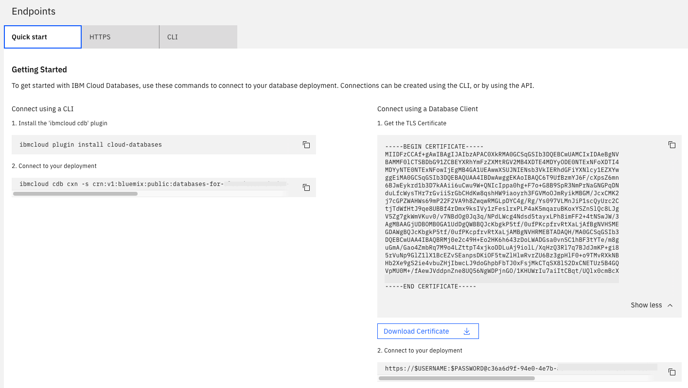

---
copyright:
  years: 2018, 2024
lastupdated: "2024-08-07"

keywords: elasticsearch connection strings, databases, elasticsearch service credentials

subcollection: databases-for-elasticsearch

---

{{site.data.keyword.attribute-definition-list}}


# Getting connection strings
{: #connection-strings}

To connect to {{site.data.keyword.databases-for-elasticsearch_full}}, you need some users and connection strings. Connection strings for your deployment are displayed on the _Overview_ page, in the _Endpoints_ panel. These strings can be used with any set of credentials that you generate.

{: caption="Figure 1. Endpoints panel" caption-side="bottom"}

A {{site.data.keyword.databases-for-elasticsearch}} deployment is provisioned with an admin user, and after you [set the admin password](/docs/databases-for-elasticsearch?topic=databases-for-elasticsearch-user-management&interface=ui#user-management-set-admin-password-ui), you can use its credentials to connect to your deployment.
{: .tip}

## Getting connection strings in the CLI
{: #connection-strings-cli}
{: cli}

You can also grab connection strings from the [CLI](/docs/databases-cli-plugin?topic=databases-cli-plugin-cdb-reference#deployment-connections).

```sh
ibmcloud cdb deployment-connections example-deployment -u <newusername> [--endpoint-type <endpoint type>]
```
{: .pre}

Full connection information is returned by the `ibmcloud cdb deployment-connections` command with the `--all` flag. To retrieve all the connection information for a deployment named "example-deployment", use the following command.

```sh
ibmcloud cdb deployment-connections example-deployment -u <newusername> --all [--endpoint-type <endpoint type>]
```
{: .pre}

If you don't specify a user, the `deployment-connections` commands return information for the admin user by default. If you don't specify an endpoint type, the connection string returns the public endpoint by default. If your deployment has only a private endpoint, you must specify `--endpoint-type private` or the commands return an error. The user and endpoint type is not enforced. You can use any user on your deployment with either endpoint (if both exist on your deployment).

To use the `ibmcloud cdb` CLI commands, you must [install the {{site.data.keyword.databases-for}} plug-in](/docs/cloud-databases?topic=cloud-databases-icd-cli).
{: .tip}

## Getting connection strings with the API
{: #connection-strings-api}
{: api}

To retrieve user's connection strings from the API, use the [`/users/{userid}/connections`](https://{DomainName}/apidocs/cloud-databases-api/cloud-databases-api-v5#getconnection) endpoint. You must specify in the path which user and which type of endpoint (public or private) should be used in the returned connection strings. The user and endpoint type is not enforced. You can use any user on your deployment with either endpoint (if both exist on your deployment).

```sh
curl -X GET -H "Authorization: Bearer $APIKEY" 'https://api.{region}.databases.cloud.ibm.com/v5/ibm/deployments/{id}/users/{user_type}/{user_id}/connections/{endpoint_type}'
```
{: .pre}

## More users and connection strings
{: #connection-strings-add-users}

Access to your {{site.data.keyword.databases-for-elasticsearch}} deployment is not limited to the admin user. You can create users by using the _Service Credentials_ page, the {{site.data.keyword.IBM_notm}} Cloud CLI, or through the {{site.data.keyword.IBM_notm}} {{site.data.keyword.databases-for}} API. 

All users on your deployment can use the connection strings, including connection strings for either public or private endpoints. 

### Creating users from the UI
{: #connection-strings-creating-users-service-cred-ui}
{: ui}

1. Navigate to the resource detail page for your service.
2. Click **Service credentials** to open the _Service Credentials_ page.
3. Click **New credential**.
4. Choose a descriptive name for your new credential. 
5. (Optional) Specify whether the new credentials use a public or private endpoint. Use either `{ "service-endpoints": "public" }` / `{ "service-endpoints": "private" }` in the _Add Inline Configuration Parameters_ field to generate connection strings using the specified endpoint. Use of the endpoint is not enforced as it controls which hostnames are in the connection strings. Public endpoints are generated by default.
6. Click **Add** to provision the new credentials. A username and password, and an associated Elasticsearch user is auto-generated.

The new credentials appear in the table, and the connection strings are available as JSON in a click-to-copy field under _View Credentials_.

### Creating users from the CLI
{: #connection-strings-creating-users-cli}
{: cli}

If you manage your service through the {{site.data.keyword.cloud_notm}} CLI and the [cloud databases plug-in](/docs/cloud-databases?topic=cloud-databases-icd-cli), you can create a new user with `cdb user-create`. For example, to create a new user for an "example-deployment", use the following command.

```sh
ibmcloud cdb user-create example-deployment <newusername> <newpassword>
```
{: .pre}

Once the task has finished, you can retrieve the new user's connection strings with the `ibmcloud cdb deployment-connections` command.

### Creating users with the API
{: #connection-strings-creating-users-api}
{: api}

The _Foundation Endpoint_ that is shown on the _Overview_ panel of your service provides the base URL to access this deployment through the API. To create and manage users, use the base URL with the `/users` endpoint.

```sh
curl -X POST 'https://api.{region}.databases.cloud.ibm.com/v5/ibm/deployments/{id}/users/{user_type}' \
-H "Authorization: Bearer $APIKEY" \
-H "Content-Type: application/json" \
-d '{"user": {"username": "user", "password": "v3ry-1-secUre-pAssword-2"}}'
```
{: .pre}

To retrieve a user's connection strings, use the base URL with the `/users/{userid}/connections` endpoint.

### Adding users to _service credentials_ in the UI
{: #connection-strings-adding-users-service-cred}
{: ui}

Creating a new user from the CLI doesn't automatically populate that user's connection strings into _Service Credentials_. If you want to add them there, you can create a new credential with the existing user information.

Enter the username and password in the JSON field _Add Inline Configuration Parameters_, or specify a file where the JSON information is stored. For example, putting `{"existing_credentials":{"username":"Robert","password":"supersecure"}}` in the field generates _Service Credentials_ with the username "Robert" and password "supersecure" filled into connection strings.

Generating credentials from an existing user does not check for or create that user.
{: tip}

## Connection String Breakdown
{: #connection-strings-breakdown}

### The HTTPS Section
{: #connection-strings-https}

The "https" section of a credential created on the *Service credentials* page contains information that is suited to applications that make connections to Elasticsearch.

| Field name | Index | Description |
| ---------- | ----- | ----------- |
| `Type` | | Type of connection - for Elasticsearch, it is "uri". |
| `Scheme` | | Scheme for a URI - for Elasticsearch, it is "https". |
| `Path` | | Path for a URI. |
| `Authentication` | `Username` | The username that you use to connect. |
| `Authentication` | `Password` | A password for the user - might be shown as `$PASSWORD`. |
| `Authentication` | `Method` | How authentication takes place; "direct" authentication is handled by the driver. |
| `Hosts` | `0...` | A hostname and port to connect to. |
| `Composed` | `0...` | A URI combining Scheme, Authentication, Host, and Path. |
| `Certificate` | `Name` | The allocated name for the self-signed certificate for database deployment. |
| `Certificate` | Base64 | A base64 encoded version of the certificate. |
{: caption="Table 1. Https/URI connection information" caption-side="top"}

* `0...` indicates that there may be one or more of these entries in an array.

### The CLI section
{: #connection-strings-cli}

The "CLI" section of a credential created on the *Service credentials* page contains information that is suited for connecting with `cURL`.

| Field name | Index | Description |
| ---------- | ----- | ----------- |
| `Bin` | | The recommended binary to create a connection; in this case it is `curl`.
| `Composed` | | A formatted command to establish a connection to your deployment. The command combines the `Bin` executable, `Environment` variable settings, and uses `Arguments` as command-line parameters. |
| `Environment` | | A list of key/values you set as environment variables. |
| `Arguments` | 0... | The information that is passed as arguments to the command shown in the Bin field. |
| `Certificate` | Base64 | A self-signed certificate that is used to confirm that an application is connecting to the appropriate server. It is base64 encoded. |
| `Certificate` | Name | The allocated name for the self-signed certificate. |
| `Type` | | The type of package that uses this connection information; in this case `cli`. |
{: caption="Table 2. curl connection information" caption-side="top"}

* `0...` indicates that there may be one or more of these entries in an array.
