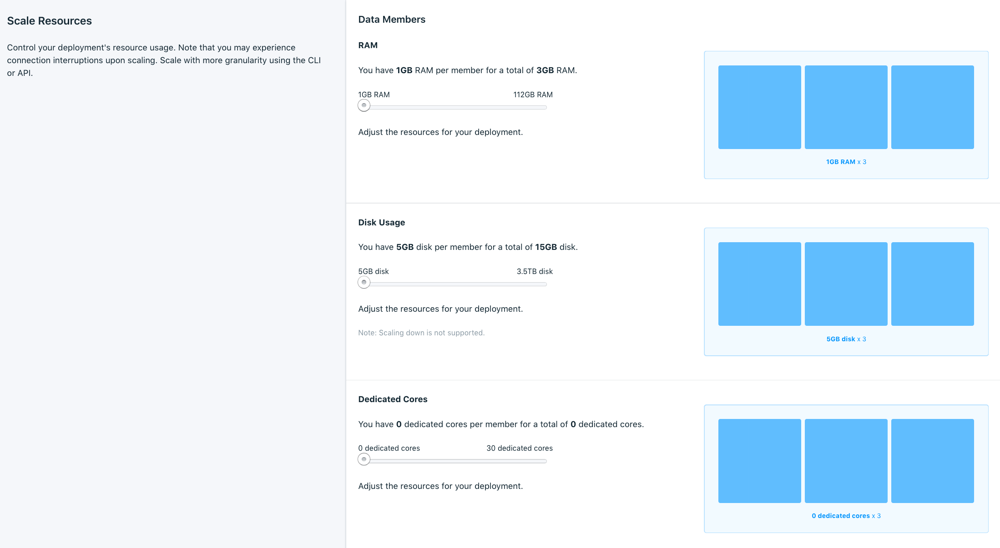

---

Copyright:
  years: 2019, 2021
lastupdated: "2021-01-11"

keywords: elasticsearch, databases, scaling, horizontal scaling

subcollection: databases-for-elasticsearch

---

{:new_window: target="_blank"}
{:shortdesc: .shortdesc}
{:screen: .screen}
{:codeblock: .codeblock}
{:pre: .pre}
{:tip: .tip}


# Adding Elasticsearch Nodes
{: #horizontal-scaling}

It is possible to scale your {{site.data.keyword.databases-for-elasticsearch_full}} deployment horizontally by adding more Elasticsearch nodes (also referred to as members). If your deployment starts to strain or slowdown, adding nodes increases capacity and reliability. When a node is added, Elasticsearch automatically balances the workload across all the nodes in your deployment.

Nodes that you add to your deployment are added with the amount of disk, memory, and CPU as the other nodes currently in your deployment. A visual representation of your data members and their resource allocation is available on the _Resources_ tab of your deployment's _Manage_ page. However, horizontal scaling is only available by using the API.



A default {{site.data.keyword.databases-for-elasticsearch_full}} deployment runs with three data members in a cluster, and resources are allocated to all three members equally. For example, the minimum storage of an Elasticsearch deployment is 15360 MB, which equates to an initial size of 5120 MB per member. The minimum RAM for an Elasticsearch deployment is 3072 MB, which equates to an initial allocation of 1028 MB per member. Adding a node adds another member with a size of 5120 MB of disk and 1028 MB of RAM, bringing your total resource usage for your deployment to 20480 MB of disk and 4096 MB of RAM.

Billing is based on the _total_ amount of resources that are allocated to the service. 
{: .tip}

## Adding Nodes through the API

The _Foundation Endpoint_ that is shown on the _Overview_ panel of your service provides the base URL to access this deployment through the API.

To view the current and scalable resources on a deployment, use the [/deployments/{id}/groups](https://cloud.ibm.com/apidocs/cloud-databases-api#get-currently-available-scaling-groups-from-a-depl)
```
curl -X GET -H "Authorization: Bearer $APIKEY" `https://api.{region}.databases.cloud.ibm.com/v4/ibm/deployments/{id}/groups'
```

To add nodes, use the [/deployments/{id}/groups/{group_id}](https://cloud.ibm.com/apidocs/cloud-databases-api#set-scaling-values-on-a-specified-group) API endpoint, sending a PATCH request with the number of nodes you want in your deployment. The example request increases the number of nodes from the default of 3 to 5.
```
curl -X PATCH 'https://api.{region}.databases.cloud.ibm.com/v4/ibm/deployments/{id}/groups/member' \
-H 'Authorization: Bearer <>' \
-H 'Content-Type: application/json' \
-d '{"members": {"allocation_count": 5}}' \
```

